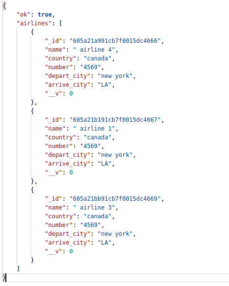

# Node-Airlines-API

This is a public API that allows crud actions for Airlines. The propject was built with Node.js and deployed on Heroku.

## Endpoints to test the API

url: https://node-airlines-api.herokuapp.com

user endpoints
- get: airlines - url/airlines
- get: a airline - url/airline/:id
- post: create a airline - url/airlines
- delete: delete a airline - url/airline/:id

 


You can download the file inside the folder postman_collection and import it in postman to test the API. You can set the local variable as url, with initial and current value = http://localhost:3000, and to test production initial and current value should be = https://node-airlines-api.herokuapp.com

## Built With

- npm 6.14.11
- node 14.16.0
- express 4.17.1
- mongoose 5.12.0

## Installation

```bash
$ npm install
```

## Author:
👤 **Gonza Javier Mancilla**

- Github: [@gonjavi](https://github.com/gonjavi)
- Linkedin: [@g-javier-mancilla](https://www.linkedin.com/in/g-mancillla)


## 🤝 Contributing

Contributions, issues and feature requests are welcome!


## Show your support

Give a ⭐️ if you like this project!


## 📝 License

This project is [MIT](lic.url) licensed.
